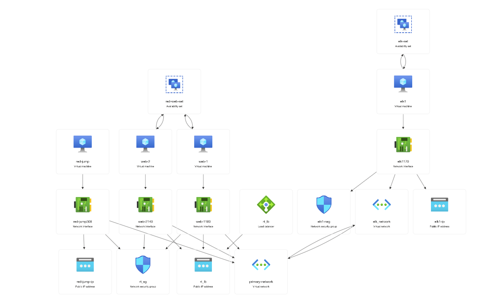
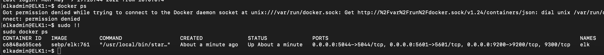

## Automated ELK Stack Deployment

The files in this repository were used to configure the network depicted below.

These files have been tested and used to generate a live ELK deployment on Azure. They can be used to either recreate the entire deployment pictured above. Alternatively, select portions of the playbook file may be used to install only certain pieces of it, such as Filebeat.

### Description of the Topology

The main purpose of this network is to expose a load-balanced and monitored instance of DVWA, the D*mn Vulnerable Web Application.

Load balancing ensures that the application will be highly secure, in addition to restricting atttacks to the network.
- Load Balancers prevent attacks like DDoS from impending the network. The jump box makes it so we can create a single point of entry into the rest of the VMs through a singular IP

Integrating an ELK server allows users to easily monitor the vulnerable VMs for changes to the data and system logs.
- Filebeat will hold and collect logs written through the local system log server of Unix with their distributions
- Metricbeat allows for the recording of the OS and services running on the Unix servers

The configuration details of each machine may be found below.

| Name     | Function | IP Address | Operating System |
|----------|----------|------------|------------------|
| Jump Box | Gateway  | 10.0.0.1   | Linux            |
| Web-1    | Web Server | 10.0.0.5 | Linux            |
| Web-2    | Web Server | 10.0.0.6 | Linux            |
| ELK      | ELK server | 10.1.0.4 | Linux            |

### Access Policies

The machines on the internal network are not exposed to the public Internet. 

Only the Red-Jump (jumpbox) machine can accept connections from the Internet. Access to this machine is only allowed from the following IP addresses:
- 68.49.45.210 the host network

Machines within the network can only be accessed by a Jumpxod through docker containers.
- The jumpbox IP 20.248.193.170 which could then allow access to the cointainers and rest of the VMs through SSH conneciton

A summary of the access policies in place can be found in the table below.

| Name     | Publicly Accessible | Allowed IP Addresses |
|----------|---------------------|----------------------|
| Jump Box |         No          |     68.49.45.210     |

### Elk Configuration

Ansible was used to automate configuration of the ELK machine. No configuration was performed manually, which is advantageous because...
- Ansible and its playbooks allow for the opportunity for downloads and configuations running through a step by step process in oder to download each specific playbook to particular IPs and VMs. This creates the chance to have an easily distributed solution for any problems that occur, as well as a versitile framework for more VMs to be added and updated if the network needs more resources.

The playbook implements the following tasks:
- Begins a download of a container program, docker.io allows for these containers being created.
- sudo docker pull then allows for an image to be downloaded
- Specific contianers throug a docker hub are generated through a docker pull
- These containers are able to run ansible
- Playbooks are then connected to each VM via private IPs being implemented into cfg files.

The following screenshot displays the result of running `docker ps` after successfully configuring the ELK instance.

### Target Machines & Beats
This ELK server is configured to monitor the following machines:
- Web-1: (IP 10.0.0.5)
- Web-2: (IP 10.0.0.6)

We have installed the following Beats on these machines:
- Filebeats and Metricbeat

These Beats allow us to collect the following information from each machine:
- These beats provide us with the logs that are given in the Web VMs local syslong. On top of that, metric records of the OS and services are stroed due to these.

### Using the Playbook
In order to use the playbook, you will need to have an Ansible control node already configured. Assuming you have such a control node provisioned: 

SSH into the control node and follow the steps below:
- playbooks can be created through etc/ansible as well as altered config files in a serperate file directory.
- Update the config file to include the IP of the ELK server so that it has a connection to Kibana while making sure your playbook is has a webserver host connected to your Web VMs
- Run the playbook, and check if its working through Kibana by going to http://20.210.232.212:5601/app/kibana
